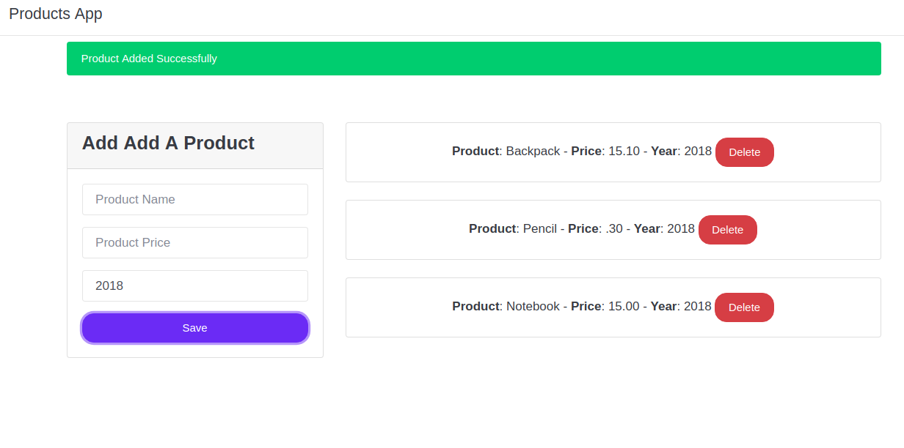

# Javascript OOP Product App
This is a simple Vanilla Javascript Frontend CRUD that uses Object Orientend Programming using Ecmascript 6+ Features.



# Start the Project
```
npm install
npm start
```

# Project Structure
* `src` is the folder with the source code

# este es el proyecto 

http://127.0.0.1:5500/src/index.html#